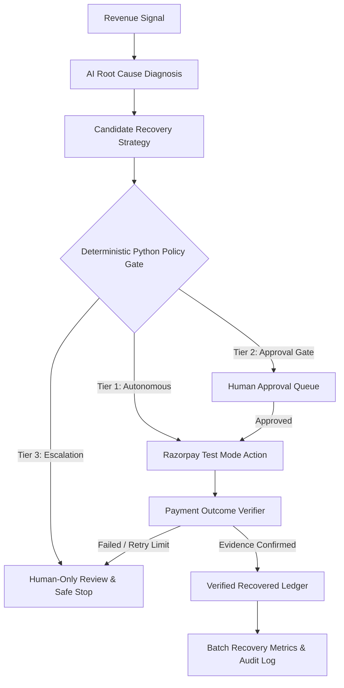

# RazorRecover — Autonomous AI Revenue Recovery Agent

[](https://razorpay.com/buildathon/)
[](https://agentrazor-ochre.vercel.app/)
[](https://agentrazor.onrender.com/)
[]()
[]()

> **RazorRecover** is an autonomous merchant-side AI agent that detects slipping revenue, diagnoses the root cause, selects bounded recovery interventions, executes actions via Razorpay Test APIs / customer channels, verifies payment evidence before closing, and measures actual revenue recovered across a batch — with deterministic safety bounds, human approval gates, idempotency safeguards, and safe stopping rules.

---

## 🌐 Live Deployed Application & Demo Links

| Service | Environment | Live URL | Description |
| :--- | :--- | :--- | :--- |
| 🚀 **Web App (Frontend)** | **Vercel** | [**`https://agentrazor-ochre.vercel.app/`**](https://agentrazor-ochre.vercel.app/) | Next.js 14 Merchant Workspace & Control Room |
| 🟣 **Judge Demo Sandbox** | **Vercel** | [**`https://agentrazor-ochre.vercel.app/demo`**](https://agentrazor-ochre.vercel.app/demo) | 2 Interactive Scenarios (₹4,800 Tier 1 & ₹28,000 Tier 2) |
| ⚙️ **API Engine (Backend)**| **Render** | [**`https://agentrazor.onrender.com/`**](https://agentrazor.onrender.com/) | Autonomous Agent Flask API & Gemini Service |
| 🗄️ **Database Cluster** | **Supabase** | `aws-0-ap-south-1.pooler.supabase.com:6543` | PostgreSQL Multi-Tenant Relational Store |

### 🔑 Instant Hackathon Demo Credentials
Judges and evaluators can log in immediately on [**`/login`**](https://agentrazor-ochre.vercel.app/login) using the one-click quick-fill buttons or:
- **👑 Merchant Admin**: `admin@razorrecover.io` / `password123`
- **💼 Finance Operator**: `finance@razorrecover.io` / `password123`
- **🔍 Auditor**: `auditor@razorrecover.io` / `password123`

---

## 8-Stage Closed-Loop Architecture



---

## System Workflow Architecture

```text
┌────────────────────────────────────────────────────────────────────────────────────────┐
│                                RAZORRECOVER WORKFLOW                                   │
└────────────────────────────────────────────────────────────────────────────────────────┘

 [1. DETECT]     Revenue Signals (Payment Failure / Abandonment / Overdue / Promise / Dispute)
      │          Ingested & ranked by financial impact & urgency in store.py
      ▼
 [2. DIAGNOSE]   Gemini AI Agent analyzes case context & client relationship memory
      │          Classifies root cause with confidence score (e.g. 94% bank timeout)
      ▼
 [3. DECIDE]     AI Agent formulates candidate recovery strategy (retry, link, follow-up)
      │
      ▼
 [4. GATE]       DETERMINISTIC PYTHON POLICY ENGINE (policy.py)
      │          ├── Tier 1 (Autonomous)  : Value < ₹5,000 → Immediate execution
      │          ├── Tier 2 (Approval)    : Value ≥ ₹5,000 / Broken Promise → Held in Approval Queue
      │          └── Tier 3 (Escalation)  : Full Dispute / ≥ ₹10k → Human-only escalation & safe stop
      │          └── Idempotency Gate    : Pre-execution lock check to prevent duplicate retries
      ▼
 [5. EXECUTE]    Razorpay Test Mode Dual Adapter (razorpay_client.py)
      │          Generates payment links or triggers test order retries (Live SDK or Mock)
      ▼
 [6. VERIFY]     Payment Outcome Verifier
      │          Polles payment evidence before closing case (Action ≠ Recovered)
      ▼
 [7. MEASURE]    Recovery Ledger (SQLite 'ledger' table) & Metrics Engine (metrics.py)
      │          Records recovered funds tied to run_id. Computes Recovery Rate & Held-Out Accuracy
      ▼
 [8. AUDIT]      Immutable Audit Logs (SQLite 'runs' table) & Live Activity Timeline (/activity)
```

---

## 👥 Role-Based Access Control (RBAC) & Interactive Testing Playbook

RazorRecover features **3 distinct operational roles** plus an **Isolated Judge Demo Sandbox**, allowing evaluators and merchants to experience the autonomous agent from every perspective:

```text
                                RAZORRECOVER OPERATIONAL ROLES
                                              │
         ┌────────────────────────────────────┼────────────────────────────────────┐
         ▼                                    ▼                                    ▼
👑 MERCHANT ADMIN                    💼 FINANCE OPERATOR                  🔍 AUDITOR
(Full Execution & Configuration)     (Approvals & Recovery Ops)           (Read-Only & Compliance)
• Run Autonomous Agent Cycles        • Review & Approve Tier 2 Queues     • Inspect Immutable Audit Logs
• Ingest Revenue Signals (CSV)       • Execute Dispute Amount Splits      • Verify Ground-Truth Accuracy %
• Configure Razorpay API & Webhooks   • Simulate Customer Checkout Links   • Review Cost Metrics & Safety
• Run Batch Evaluation Benchmarks      (/pay/[id])                         Stopping Rules
```

---

### 🟣 Mode 0: Quick Demo Sandbox (No Login Required)
> **Direct Link**: [**`https://agentrazor-ochre.vercel.app/demo`**](https://agentrazor-ochre.vercel.app/demo)
1. Navigate to `/demo` or click **"Explore Interactive Demo"** on the landing page.
2. **Scenario 1 (₹4,800 · Tier 1 Autonomous Recovery)**:
   - Click **Step 1: Detect Signal** → Bank timeout failure ingested.
   - Click **Step 2: AI Root Cause Diagnosis** → Gemini diagnoses the timeout with 94% confidence.
   - Click **Step 3: Deterministic Policy Gate** → Tier 1 auto-approval (< ₹5,000).
   - Click **Step 4: Execute Recovery Action** → Razorpay Test Mode recovery payment link generated.
   - Click **Step 5: Verify Payment & Settle** → Click **"Simulate Customer Payment"** → Watch ₹4,800 added to the **Verified Recovery Ledger** in real time!
3. **Scenario 2 (₹28,000 · Tier 2 Broken Promise)**:
   - Follow the steps to see the deterministic policy **hold the action in the Approval Queue** for human authorization.

---

### 👑 Role 1: 👑 Merchant Admin Testing Guide
> **Login**: `admin@razorrecover.io` / `password123` (or click **👑 Merchant Admin** on `/login`)  
> **Key Pages**: `/dashboard`, `/revenue-sources`, `/agent`
1. **Log in as Merchant Admin**: Notice the blue **Merchant Admin Control Room** header and live APScheduler daemon status.
2. **Batch CSV Ingestion**:
   - Click **`Import CSV`** in the top-right header of `/dashboard`.
   - Click **`Download Sample CSV`** to get a formatted test file (`razorrecover_failed_payments_sample.csv`).
   - Upload it and click **`Import & Analyze Batch`** → Notice 4 new cases populated in the table!
3. **Trigger Autonomous Cycle**:
   - Click **`Process Batch Now`** → The agent calls Gemini, diagnoses failures, assigns policy tiers, and creates Razorpay recovery links.
4. **Gateway Configuration (`/revenue-sources`)**:
   - Inspect the live **Razorpay Test Mode Webhook Endpoint** and test gateway latency via **PING**.

---

### 💼 Role 2: 💼 Finance Operator Testing Guide
> **Login**: `finance@razorrecover.io` / `password123` (or click **💼 Finance Operator** on `/login`)  
> **Key Pages**: `/approvals`, `/dashboard`, `/analytics`
1. **Log in as Finance Operator**: Notice the amber **Finance Operations Control** banner.
2. **Review Tier 2 Approvals Queue (`/approvals`)**:
   - View all high-value cases held by the deterministic policy engine.
   - Inspect Gemini's root cause diagnosis and recommended action for each customer.
3. **Authorize Recovery Action**:
   - Click **`[ Authorize & Dispatch Link ]`** on any pending case → Case immediately moves to `RECOVERING`.
4. **Simulate Customer Payment**:
   - In the table on `/dashboard`, find any case in `RECOVERING` state and click **`Quick Pay`**.
   - The interactive **Razorpay Checkout Modal** opens.
   - Click **`Simulate Successful Payment (Test Mode)`** → Case moves to **`RECOVERED`** and settles into the financial ledger!

---

### 🔍 Role 3: 🔍 Auditor Testing Guide
> **Login**: `auditor@razorrecover.io` / `password123` (or click **🔍 Auditor** on `/login`)  
> **Key Pages**: `/dashboard`, `/activity`, `/analytics`
1. **Log in as Auditor**: Notice the purple **Compliance & Audit Control** banner and `Read-Only Mode Enforced` lock badge.
2. **Verify RBAC Security Protection**:
   - Notice all execution and configuration buttons are hidden or disabled.
   - Attempting unauthorized administrative actions is strictly blocked with HTTP 403.
3. **Inspect 6-Stage Audit Trail (`/dashboard`)**:
   - Click any case in the table to load the interactive **6-Stage Audit Trail** (Ingestion → AI Diagnosis → Policy Gating → Authorization Proof → Razorpay Verification → Immutable Ledger).
4. **Inspect Live Audit Stream (`/activity`)**:
   - Review chronological execution logs tagged with unique `run_id` timestamps.

---

### 📊 Testing Matrix by Role

| Role | Quick Login Email | Primary Pages | Main Action to Test |
| :--- | :--- | :--- | :--- |
| **👑 Merchant Admin** | `admin@razorrecover.io` | `/dashboard`, `/revenue-sources` | Upload CSV → Click **Process Batch Now** |
| **💼 Finance Operator** | `finance@razorrecover.io` | `/approvals`, `/dashboard` | Click **Authorize & Dispatch Link** → Click **Quick Pay** |
| **🔍 Auditor** | `auditor@razorrecover.io` | `/dashboard`, `/activity` | Click any case row → Inspect **6-Stage Audit Trail** |
| **🟣 Sandbox (All)** | *No login* | `/demo` | Follow **Step 1 → Step 5** interactive recovery |

## Data & Persistence Architecture

RazorRecover uses **SQLite** (`backend/data/razorrecover.db`) as its transactional relational datastore for hackathon execution and demo reliability:

- **Relational Tables**:
  - `cases` — Revenue-at-risk cases, states, customer relationships, and timestamps.
  - `clients` — Client history profiles, average days to pay, promise reliability ratios.
  - `ledger` — Verified recovery receipts with financial amounts linked to unique `run_id`.
  - `runs` — Immutable chronological audit logs of AI diagnoses, policy gates, and actions.
  - `idempotency_locks` — Persistent ACID locks with TTLs preventing duplicate action charges across restarts.
- **Transactional Safety**: All state transitions use SQLite transactions (`_db_session()`) with rollback on exception.
- **Modular Abstraction**: The persistence layer is cleanly abstracted in `backend/store.py`, allowing drop-in connection to Supabase / PostgreSQL in cloud production without altering the core agent or policy rules.

---

## Key Features

1. **Deterministic 3-Tier Policy Engine**:
   - **Tier 1 (Autonomous)**: Low-risk routine payment retries & recovery link generation (< ₹5,000).
   - **Tier 2 (Approval Gate)**: High-value recovery (≥ ₹5,000), broken promises, or repeated contact attempts held in Approval Queue.
   - **Tier 3 (Human Only Escalation)**: Full invoice disputes or disputed amounts ≥ ₹10,000 strictly block autonomous action and escalate to owner.
2. **Dual Adapter Architecture**:
   - Interacts directly with Razorpay Test Mode APIs (Orders, Payment Links, Invoices, Status Verification) when credentials are provided, with deterministic Mock Adapter fallback.
3. **5 Revenue-Loss Scenarios Covered**:
   - **Payment Failure**: Bank timeout or insufficient funds → Automatic retry / recovery link.
   - **Checkout Abandonment**: Unfinished checkout session → Recovery payment link.
   - **Overdue B2B Invoice**: Receivables past net terms → Client relationship-aware follow-up.
   - **Broken Payment Promise**: Expired commitment without payment evidence → Tier 2 approval gate.
   - **Invoice Dispute**: Contested amount → `split_disputed_amount()` into undisputed recovery + Tier 3 human dispute escalation.
4. **Idempotency & Safe Stopping Safeguards**:
   - In-memory lock checks preventing duplicate retries or concurrent duplicate actions. Safe stopping after `MAX_RETRY_COUNT = 3`.
5. **60-Case Batch Evaluation**:
   - 40 development cases + 20 held-out evaluation cases with hidden ground-truth expected decisions to compute decision accuracy %.
6. **5 Interactive Next.js App Router Pages**:
   - `/` — Polished Landing & Core Loop Overview
   - `/dashboard` — Revenue Control Room & Hero KPI Cards
   - `/approvals` — Tier 2 Human Approval Queue with One-Tap Actions
   - `/cases/[id]` — Case Investigation Detail View & Interactive Timeline
   - `/analytics` — Measured Recovery Analytics & Held-Out Decision Accuracy Report
   - `/activity` — Live Agent Decision & Action Audit Log (`run_id`)

---

## Live Mode vs Batch Evaluation Mode

RazorRecover provides strict architectural separation between live merchant/test operations and batch evaluation benchmarks:

```text
                               RAZORRECOVER ENGINE
                                        │
             ┌──────────────────────────┴──────────────────────────┐
             ▼                                                     ▼
    LIVE TEST MODE                                      BATCH EVALUATION MODE
    (Razorpay Test Mode APIs)                           (Held-Out Test Benchmark)
    • Live Test Order Retries                           • 60 Synthetic Revenue-Loss Cases
    • Real Payment Link Generation                      • Ground-Truth Expected Decisions
    • Payment Verification Webhooks                      • Held-Out Accuracy % & Cost Metrics
```

### Dedicated Evaluation Endpoints
- `POST /api/evaluation/generate`: Generates 60 synthetic evaluation cases (40 dev / 20 held-out test split).
- `POST /api/evaluation/run`: Runs batch evaluation cycle over held-out dataset.
- `GET  /api/evaluation/results`: Retrieves held-out decision accuracy %, false positive cost, and recovery metrics.

---

## 🎬 Product Walkthrough & Evaluation Guide

Judges and evaluators can follow this end-to-end evaluation flow to test the closed-loop recovery agent:

1. **Problem Context & Revenue Leakage**: Navigate to `/dashboard` to review active revenue signals across payment failures, broken promises, and overdue invoices.
2. **Autonomous Tier 1 Recovery Flow**:
   - Inspect a low-value failure (< ₹5,000) on `/cases/[id]`.
   - Observe **Gemini 2.5** root cause diagnosis (e.g. *Bank Timeout* with 94% confidence).
   - Verify that the **Deterministic Python Policy Gate** approves Tier 1 autonomous link generation via Razorpay Test APIs.
   - Click **`Quick Pay`** on the interactive checkout simulator to complete payment and watch the **Verified Recovery Ledger** settle the funds.
3. **Governance, Safety & Approval Gates**:
   - Inspect high-value cases (≥ ₹5,000) or broken commitments routed to **`/approvals`** for human authorization.
   - Test one-tap authorization to execute recovery actions, or inspect high-risk dispute cases (≥ ₹10,000) safely stopped and escalated.
4. **Batch Evaluation Benchmark & Ground-Truth Verification**:
   - Switch to **Batch Evaluation Mode** on the Control Room.
   - Click **`RUN BATCH EVALUATION`** to process a 60-case dataset (40 dev / 20 held-out test split) with ground-truth expected decisions to compute decision accuracy %.
5. **Independent Auditability**:
   - Open **`/activity`** as an Auditor to inspect immutable `run_id` audit traces detailing each diagnosis, policy gate check, action attempt, and verification receipt.

---

## Getting Started

### 1. Prerequisites
- Python 3.10+
- Node.js 18+

### 2. Backend Setup
```bash
cd backend
python -m venv .venv
# On Windows:
.venv\Scripts\activate
# On macOS/Linux:
source .venv/bin/activate

pip install -r requirements.txt
python seed_data.py
python app.py
```
Backend server runs on `http://localhost:5000`.

### 3. Frontend Setup
```bash
cd frontend
npm install
npm run dev
```
Frontend application opens on `http://localhost:3000`.

### 4. Running Automated Verification Suites & Tests

RazorRecover includes 4 automated verification test suites covering deterministic policy logic, pure JWT security, multi-role RBAC isolation, and live CSV signal ingestion:

```bash
# 1. Deterministic Policy Rules & Agent Fallback Unit Tests
python -m unittest backend/tests/test_correctness.py

# 2. Pure JWT Security & Unauthorized Access Enforcement (HTTP 401/403)
python backend/tests/test_jwt_verification.py

# 3. Multi-Tenant Role Authentication, Workspace Separation & RBAC
python backend/tests/test_role_experiences.py

# 4. Live Multi-Part CSV Ingestion & Revenue Signal Parsing
python backend/tests/test_csv_ingestion_live.py
```

> **Testing against Remote Production Deployments:**
> Set the `TEST_BASE_URL` environment variable to test against Render/Production:
> ```bash
> TEST_BASE_URL="https://agentrazor.onrender.com" python backend/tests/test_jwt_verification.py
> ```

---

## Complete Verification & Test Suite Matrix

| Test Suite | File | Focus Area | Verification Standard |
| :--- | :--- | :--- | :--- |
| **Deterministic Policy Engine** | [`backend/tests/test_correctness.py`](file:///backend/tests/test_correctness.py) | Tier 1 (< ₹5k) vs Tier 2 (≥ ₹5k) vs Tier 3 (Escalation) | 100% Deterministic python gate compliance |
| **Pure JWT Auth & Security** | [`backend/tests/test_jwt_verification.py`](file:///backend/tests/test_jwt_verification.py) | Token forging, missing auth, header tampering | Strict HTTP 401 on forged/missing tokens |
| **Multi-Role Workspaces & RBAC** | [`backend/tests/test_role_experiences.py`](file:///backend/tests/test_role_experiences.py) | Merchant Admin, Finance Ops, Auditor isolation | Strict HTTP 403 on unauthorized actions |
| **CSV Ingestion Pipeline** | [`backend/tests/test_csv_ingestion_live.py`](file:///backend/tests/test_csv_ingestion_live.py) | Multi-part file upload, validation, case creation | 4 new cases ingested into PostgreSQL/SQLite |
| **E2E Next.js Build** | `npm run build` in `frontend/` | 13 dynamic/static Next.js 14 App Router routes | 0 compilation errors or broken imports |

---

## Honest Metric Disclaimer
All revenue metrics and recovery percentages displayed in the application represent **Measured Simulated Revenue Recovered in Razorpay Test Mode**. No claims are made regarding live merchant production funds.
