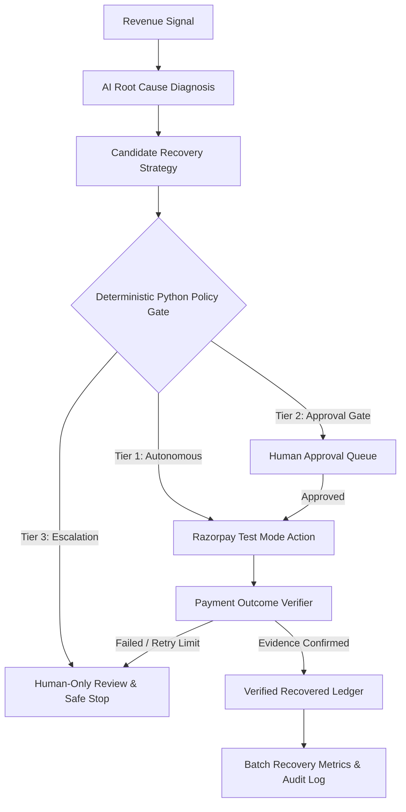

# RazorRecover — Autonomous AI Revenue Recovery Agent

[](https://razorpay.com/buildathon/)
[](https://agentrazor-ochre.vercel.app/)
[](https://agentrazor.onrender.com/)
[]()
[]()

> **RazorRecover** is an autonomous merchant-side AI agent that detects slipping revenue, diagnoses the root cause, selects bounded recovery interventions, executes actions via Razorpay Test APIs / customer channels, verifies payment evidence before closing, and measures actual revenue recovered across a batch — with deterministic safety bounds, human approval gates, idempotency safeguards, and safe stopping rules.

---

## 🌐 Live Deployed Application & Demo Links

| Service | Environment | Live URL | Description |
| :--- | :--- | :--- | :--- |
| 🚀 **Web App (Frontend)** | **Vercel** | [**`https://agentrazor-ochre.vercel.app/`**](https://agentrazor-ochre.vercel.app/) | Next.js 14 Merchant Workspace & Control Room |
| 🟣 **Judge Demo Sandbox** | **Vercel** | [**`https://agentrazor-ochre.vercel.app/demo`**](https://agentrazor-ochre.vercel.app/demo) | 2 Interactive Scenarios (₹4,800 Tier 1 & ₹28,000 Tier 2) |
| ⚙️ **API Engine (Backend)**| **Render** | [**`https://agentrazor.onrender.com/`**](https://agentrazor.onrender.com/) | Autonomous Agent Flask API & Gemini Service |
| 🗄️ **Database Cluster** | **Supabase** | `aws-0-ap-south-1.pooler.supabase.com:6543` | PostgreSQL Multi-Tenant Relational Store |

### 🔑 Instant Hackathon Demo Credentials
Judges and evaluators can log in immediately on [**`/login`**](https://agentrazor-ochre.vercel.app/login) using the one-click quick-fill buttons or:
- **👑 Merchant Admin**: `admin@razorrecover.io` / `password123`
- **💼 Finance Operator**: `finance@razorrecover.io` / `password123`
- **🔍 Auditor**: `auditor@razorrecover.io` / `password123`

---

## 8-Stage Closed-Loop Architecture



---

## System Workflow Architecture

```text
┌────────────────────────────────────────────────────────────────────────────────────────┐
│                                RAZORRECOVER WORKFLOW                                   │
└────────────────────────────────────────────────────────────────────────────────────────┘

 [1. DETECT]     Revenue Signals (Payment Failure / Abandonment / Overdue / Promise / Dispute)
      │          Ingested & ranked by financial impact & urgency in store.py
      ▼
 [2. DIAGNOSE]   Gemini AI Agent analyzes case context & client relationship memory
      │          Classifies root cause with confidence score (e.g. 94% bank timeout)
      ▼
 [3. DECIDE]     AI Agent formulates candidate recovery strategy (retry, link, follow-up)
      │
      ▼
 [4. GATE]       DETERMINISTIC PYTHON POLICY ENGINE (policy.py)
      │          ├── Tier 1 (Autonomous)  : Value < ₹5,000 → Immediate execution
      │          ├── Tier 2 (Approval)    : Value ≥ ₹5,000 / Broken Promise → Held in Approval Queue
      │          └── Tier 3 (Escalation)  : Full Dispute / ≥ ₹10k → Human-only escalation & safe stop
      │          └── Idempotency Gate    : Pre-execution lock check to prevent duplicate retries
      ▼
 [5. EXECUTE]    Razorpay Test Mode Dual Adapter (razorpay_client.py)
      │          Generates payment links or triggers test order retries (Live SDK or Mock)
      ▼
 [6. VERIFY]     Payment Outcome Verifier
      │          Polles payment evidence before closing case (Action ≠ Recovered)
      ▼
 [7. MEASURE]    Recovery Ledger (SQLite 'ledger' table) & Metrics Engine (metrics.py)
      │          Records recovered funds tied to run_id. Computes Recovery Rate & Held-Out Accuracy
      ▼
 [8. AUDIT]      Immutable Audit Logs (SQLite 'runs' table) & Live Activity Timeline (/activity)
```

---

## Role-Based Access Control (RBAC) & User Workflows

RazorRecover features **3 distinct operational roles**, switchable directly in the global header navbar:

```text
                                RAZORRECOVER OPERATIONAL ROLES
                                              │
         ┌────────────────────────────────────┼────────────────────────────────────┐
         ▼                                    ▼                                    ▼
👑 MERCHANT ADMIN                    💼 FINANCE OPERATOR                  🔍 AUDITOR
(Full Execution & Configuration)     (Approvals & Recovery Ops)           (Read-Only & Compliance)
• Run Autonomous Agent Cycles        • Review & Approve Tier 2 Queues     • Inspect Immutable Audit Logs
• Override Policy Gates              • Execute Dispute Amount Splits      • Verify Ground-Truth Accuracy %
• Configure Razorpay API & Webhooks   • Inspect Payment Links & Customer   • Review Cost Metrics & Safety
• Run Batch Evaluation Benchmarks      Gateway Portal                      Stopping Rules
```

### 1. 👑 Merchant Admin Workflow
The **Merchant Admin** has complete operational & administrative control over the AI recovery agent and gateway integrations:

1. **Configure Gateway Connections**: Click **`Razorpay Gateway`** in the top header to inspect Razorpay API credentials (`rzp_test_...`), test gateway latency via **PING**, or sync active merchant receivables via **SYNC INVOICES**.
2. **Trigger Autonomous Agent Cycles**: In the **Revenue Control Room (`/dashboard`)**, click **`RUN RECOVERY CYCLE`**. The agent executes the closed loop across all active cases, auto-recovering Tier 1 signals (< ₹5,000) via Razorpay Test APIs.
3. **Evaluate Model Accuracy**: Switch to **`Batch Evaluation Mode`** on the Control Room and click **`RUN BATCH EVALUATION`** to test agent decisions on a 60-case dataset (40 dev / 20 held-out test split) with ground-truth expected decisions.
4. **Policy Overrides & Dispute Splitting**: Inspect high-value dispute cases on `/cases/[id]` and trigger `split_disputed_amount()` to isolate uncontested revenue from disputed funds.

---

### 2. 💼 Finance Operator Workflow
The **Finance Operator** manages day-to-day approval queues, payment link verification, and customer recovery channels:

1. **Review Tier 2 Approval Queue (`/approvals`)**: Open the Approval Queue to view all cases flagged for human consent (broken promises, high-value cases ≥ ₹5,000, or customized payment plans).
2. **Approve or Reject Interventions**: Inspect the AI root cause diagnosis and strategic recommendation. Click **`[ APPROVE & EXECUTE ]`** to trigger the Razorpay payment link/retry, or **`[ REJECT & ESCALATE ]`** to hold for owner review.
3. **Test Payment Verification**: Click **`Pay Test`** on any active case to launch the **Interactive Razorpay Checkout Simulator Modal** (UPI, Card, Netbanking) or share the customer payment gateway URL (`/pay/[id]`).
4. **Monitor Ledger & Financial Metrics (`/analytics`)**: Track verified cash flow receipts in the Verified Recovery Ledger and analyze scenario recovery rates across payment failures, B2B overdue invoices, and checkout abandonments.

---

### 3. 🔍 Auditor Workflow
The **Auditor** ensures strict adherence to governance, deterministic policy bounds, compliance standards, and risk caps:

1. **Inspect Agent Audit Logs (`/activity`)**: Review real-time, chronological execution traces tagged with unique `run_id` timestamps detailing every AI diagnosis, policy check, action attempt, and verification outcome.
2. **Verify Deterministic Policy Compliance**: Inspect cases to confirm that Tier 3 high-risk actions (disputed amounts ≥ ₹10,000 or contested charges) strictly blocked autonomous execution and escalated safely.
3. **Validate Held-Out Benchmark Accuracy**: Navigate to **`/analytics`** to review held-out evaluation decision accuracy %, false-positive cost analysis, and idempotency lock logs.
4. **Audit Idempotency & Safe Stopping Bounds**: Confirm that retry limits (`MAX_RETRY_COUNT = 3`) and pre-execution idempotency locks prevented duplicate payment charges.

---

## Data & Persistence Architecture

RazorRecover uses **SQLite** (`backend/data/razorrecover.db`) as its transactional relational datastore for hackathon execution and demo reliability:

- **Relational Tables**:
  - `cases` — Revenue-at-risk cases, states, customer relationships, and timestamps.
  - `clients` — Client history profiles, average days to pay, promise reliability ratios.
  - `ledger` — Verified recovery receipts with financial amounts linked to unique `run_id`.
  - `runs` — Immutable chronological audit logs of AI diagnoses, policy gates, and actions.
  - `idempotency_locks` — Persistent ACID locks with TTLs preventing duplicate action charges across restarts.
- **Transactional Safety**: All state transitions use SQLite transactions (`_db_session()`) with rollback on exception.
- **Modular Abstraction**: The persistence layer is cleanly abstracted in `backend/store.py`, allowing drop-in connection to Supabase / PostgreSQL in cloud production without altering the core agent or policy rules.

---

## Key Features

1. **Deterministic 3-Tier Policy Engine**:
   - **Tier 1 (Autonomous)**: Low-risk routine payment retries & recovery link generation (< ₹5,000).
   - **Tier 2 (Approval Gate)**: High-value recovery (≥ ₹5,000), broken promises, or repeated contact attempts held in Approval Queue.
   - **Tier 3 (Human Only Escalation)**: Full invoice disputes or disputed amounts ≥ ₹10,000 strictly block autonomous action and escalate to owner.
2. **Dual Adapter Architecture**:
   - Interacts directly with Razorpay Test Mode APIs (Orders, Payment Links, Invoices, Status Verification) when credentials are provided, with deterministic Mock Adapter fallback.
3. **5 Revenue-Loss Scenarios Covered**:
   - **Payment Failure**: Bank timeout or insufficient funds → Automatic retry / recovery link.
   - **Checkout Abandonment**: Unfinished checkout session → Recovery payment link.
   - **Overdue B2B Invoice**: Receivables past net terms → Client relationship-aware follow-up.
   - **Broken Payment Promise**: Expired commitment without payment evidence → Tier 2 approval gate.
   - **Invoice Dispute**: Contested amount → `split_disputed_amount()` into undisputed recovery + Tier 3 human dispute escalation.
4. **Idempotency & Safe Stopping Safeguards**:
   - In-memory lock checks preventing duplicate retries or concurrent duplicate actions. Safe stopping after `MAX_RETRY_COUNT = 3`.
5. **60-Case Batch Evaluation**:
   - 40 development cases + 20 held-out evaluation cases with hidden ground-truth expected decisions to compute decision accuracy %.
6. **5 Interactive Next.js App Router Pages**:
   - `/` — Polished Landing & Core Loop Overview
   - `/dashboard` — Revenue Control Room & Hero KPI Cards
   - `/approvals` — Tier 2 Human Approval Queue with One-Tap Actions
   - `/cases/[id]` — Case Investigation Detail View & Interactive Timeline
   - `/analytics` — Measured Recovery Analytics & Held-Out Decision Accuracy Report
   - `/activity` — Live Agent Decision & Action Audit Log (`run_id`)

---

## Live Mode vs Batch Evaluation Mode

RazorRecover provides strict architectural separation between live merchant/test operations and batch evaluation benchmarks:

```text
                               RAZORRECOVER ENGINE
                                        │
             ┌──────────────────────────┴──────────────────────────┐
             ▼                                                     ▼
    LIVE TEST MODE                                      BATCH EVALUATION MODE
    (Razorpay Test Mode APIs)                           (Held-Out Test Benchmark)
    • Live Test Order Retries                           • 60 Synthetic Revenue-Loss Cases
    • Real Payment Link Generation                      • Ground-Truth Expected Decisions
    • Payment Verification Webhooks                      • Held-Out Accuracy % & Cost Metrics
```

### Dedicated Evaluation Endpoints
- `POST /api/evaluation/generate`: Generates 60 synthetic evaluation cases (40 dev / 20 held-out test split).
- `POST /api/evaluation/run`: Runs batch evaluation cycle over held-out dataset.
- `GET  /api/evaluation/results`: Retrieves held-out decision accuracy %, false positive cost, and recovery metrics.

---

## 4-Minute Hackathon Demo Script Guide

1. **0:00–0:25 — Problem Statement**: Show slipping revenue across payment failures and broken promises (*"Merchants don't lose revenue because they can't see failed payments; they lose it because nobody closes the loop."*).
2. **0:25–1:35 — Hero Workflow (Live Test Mode)**: Show ₹4,800 payment failure → AI diagnosis (bank timeout) → Tier 1 policy approval → Razorpay Test Mode execution → payment evidence verification → ₹4,800 recovered.
3. **1:35–2:15 — Governance & Safety**:
   - Show ₹18,000 broken promise → Tier 2 Policy Gate → Approval Queue → One-tap approval.
   - Show ₹42,000 full dispute → Tier 3 Policy Gate → Autonomous action strictly blocked → Escalated to owner.
4. **2:15–3:05 — Batch Evaluation Mode**: Click **`Batch Evaluation Mode`** → **`RUN BATCH EVALUATION`** → Display 60 processed cases, ₹8.42L at risk, ₹3.16L recovered (37.5% rate), and 100% held-out decision accuracy.
5. **3:05–4:00 — Auditability & Closing**: Show case history timeline with `run_id` audit logs (*"Detect revenue risk. Diagnose the cause. Recover what can be recovered. Stop safely when it can't."*).

---

## Getting Started

### 1. Prerequisites
- Python 3.10+
- Node.js 18+

### 2. Backend Setup
```bash
cd backend
python -m venv .venv
# On Windows:
.venv\Scripts\activate
# On macOS/Linux:
source .venv/bin/activate

pip install -r requirements.txt
python seed_data.py
python app.py
```
Backend server runs on `http://localhost:5000`.

### 3. Frontend Setup
```bash
cd frontend
npm install
npm run dev
```
Frontend application opens on `http://localhost:3000`.

### 4. Running Automated Verification Suites & Tests

RazorRecover includes 4 automated verification test suites covering deterministic policy logic, pure JWT security, multi-role RBAC isolation, and live CSV signal ingestion:

```bash
# 1. Deterministic Policy Rules & Agent Fallback Unit Tests
python -m unittest backend/tests/test_correctness.py

# 2. Pure JWT Security & Unauthorized Access Enforcement (HTTP 401/403)
python backend/tests/test_jwt_verification.py

# 3. Multi-Tenant Role Authentication, Workspace Separation & RBAC
python backend/tests/test_role_experiences.py

# 4. Live Multi-Part CSV Ingestion & Revenue Signal Parsing
python backend/tests/test_csv_ingestion_live.py
```

> **Testing against Remote Production Deployments:**
> Set the `TEST_BASE_URL` environment variable to test against Render/Production:
> ```bash
> TEST_BASE_URL="https://agentrazor.onrender.com" python backend/tests/test_jwt_verification.py
> ```

---

## Complete Verification & Test Suite Matrix

| Test Suite | File | Focus Area | Verification Standard |
| :--- | :--- | :--- | :--- |
| **Deterministic Policy Engine** | [`backend/tests/test_correctness.py`](file:///backend/tests/test_correctness.py) | Tier 1 (< ₹5k) vs Tier 2 (≥ ₹5k) vs Tier 3 (Escalation) | 100% Deterministic python gate compliance |
| **Pure JWT Auth & Security** | [`backend/tests/test_jwt_verification.py`](file:///backend/tests/test_jwt_verification.py) | Token forging, missing auth, header tampering | Strict HTTP 401 on forged/missing tokens |
| **Multi-Role Workspaces & RBAC** | [`backend/tests/test_role_experiences.py`](file:///backend/tests/test_role_experiences.py) | Merchant Admin, Finance Ops, Auditor isolation | Strict HTTP 403 on unauthorized actions |
| **CSV Ingestion Pipeline** | [`backend/tests/test_csv_ingestion_live.py`](file:///backend/tests/test_csv_ingestion_live.py) | Multi-part file upload, validation, case creation | 4 new cases ingested into PostgreSQL/SQLite |
| **E2E Next.js Build** | `npm run build` in `frontend/` | 13 dynamic/static Next.js 14 App Router routes | 0 compilation errors or broken imports |

---

## Honest Metric Disclaimer
All revenue metrics and recovery percentages displayed in the application represent **Measured Simulated Revenue Recovered in Razorpay Test Mode**. No claims are made regarding live merchant production funds.
